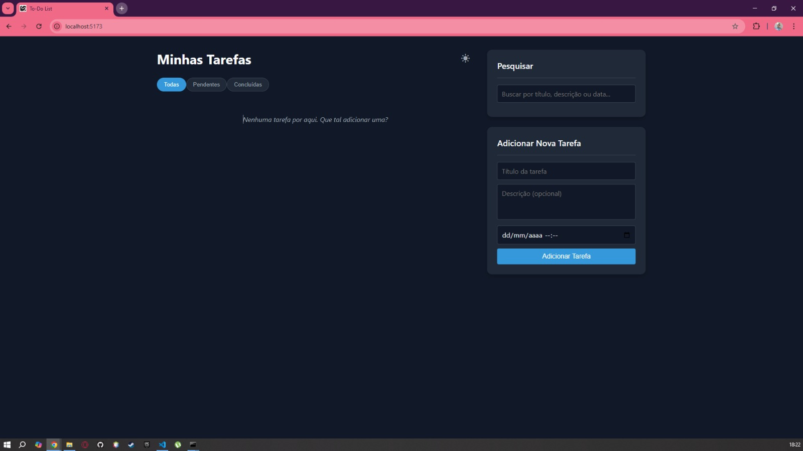
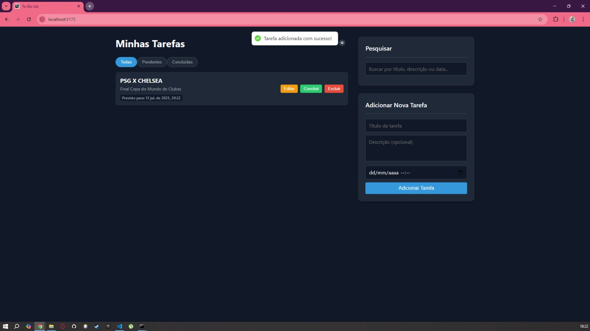
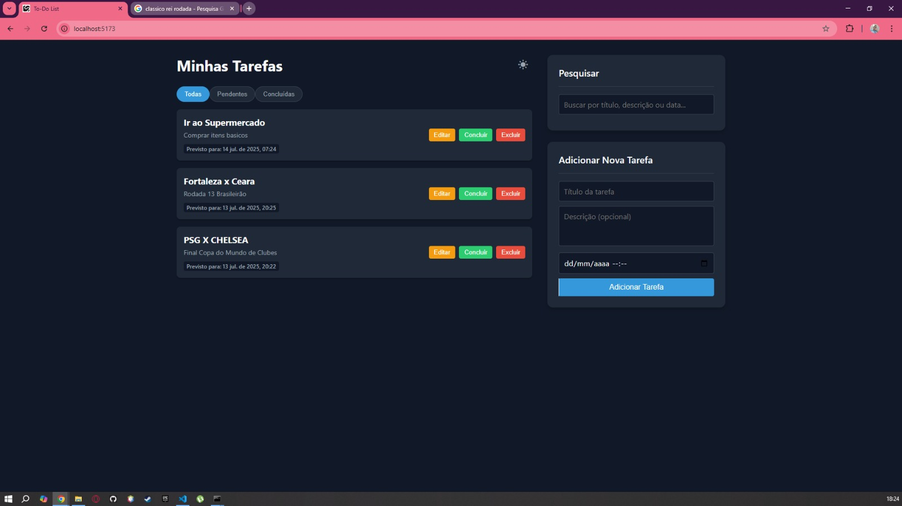
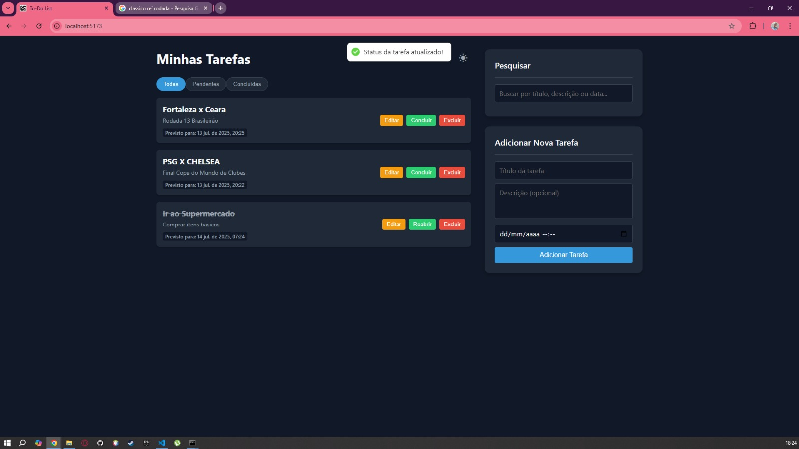
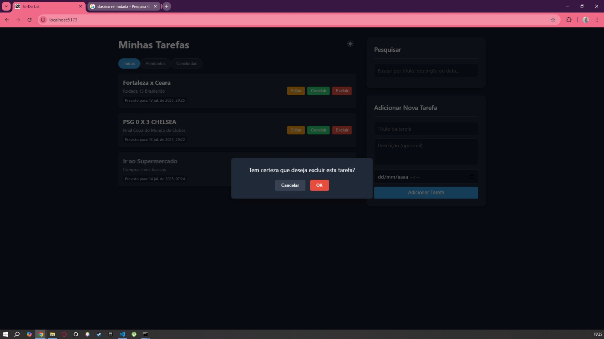
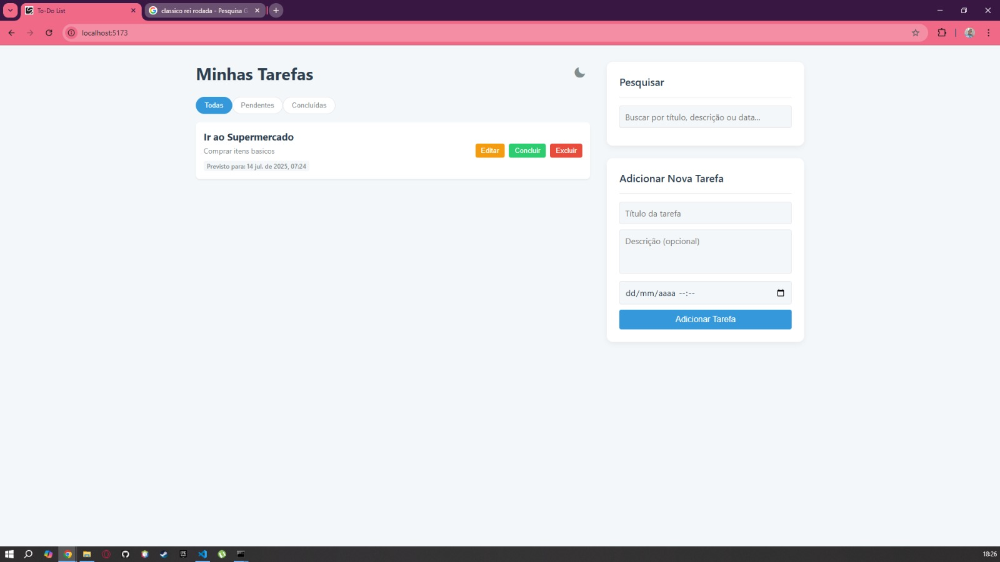

<div align="center">
  
</div>


# Desafio To-Do List

Aplicação web completa de uma lista de tarefas ("To-Do List") desenvolvida como um desafio técnico para o processo seletivo da **Stec Inteligência Artificial**. O projeto inclui um backend com API RESTful e um frontend reativo para uma experiência de usuário fluida.

---

## 📸 Screenshot










---

## ✨ Funcionalidades

-   **CRUD Completo de Tarefas:**
    -   ✅ **Criar** novas tarefas com título e descrição.
    -   ✅ **Ler** e listar todas as tarefas existentes.
    -   ✅ **Atualizar** o status, título, descrição e data de uma tarefa.
    -   ✅ **Deletar** tarefas individualmente.
-  **Gerenciamento Avançado de Tarefas:**
    -   ✅ **Ordenação Inteligente:** Tarefas concluídas são automaticamente movidas para o final da lista, mantendo o foco no que é pendente.
    -   ✅ **Filtros de Status:** Botões para visualizar apenas tarefas "Pendentes", "Concluídas" ou "Todas".
    -   ✅ **Busca Abrangente:** Pesquisa em tempo real por título, descrição ou data de vencimento.
-   **Experiência do Usuário:**
    -   ✅ **Modo Escuro:** Toggle para alternar entre os temas claro e escuro.
    -   ✅ **Notificações Toast:** Feedback visual para sucesso ou erro nas operações.
    -   ✅ **Modal de Confirmação:** Previne exclusões acidentais com uma caixa de diálogo customizada.
    -   ✅ **Layout Responsivo:** A interface é responsiva e se adapta bem a diferentes tamanhos de tela, incluindo dispositivos móveis.
-   **Qualidade de Código:**
    -   ✅ **Backend Estruturado:** Lógica de API organizada.
    -   ✅ **Frontend Componentizado:** Interface construída com componentes React reutilizáveis.
    -   ✅ **Serviço de API Abstraído:** As chamadas à API no frontend são centralizadas em um módulo de serviço, seguindo o princípio de Separação de Responsabilidades.

---

## 🛠️ Tecnologias Utilizadas

**Backend:**
-   **Node.js:** Ambiente de execução JavaScript no servidor.
-   **Express.js:** Framework para a construção da API RESTful.
-   **SQLite:** Banco de dados SQL leve e baseado em arquivo.
-   **CORS:** Middleware para permitir a comunicação entre domínios diferentes (frontend e backend).

**Frontend:**
-   **React (com Vite):** Biblioteca para a construção da interface de usuário e ambiente de desenvolvimento rápido.
-   **Axios:** Cliente HTTP para fazer as requisições à API do backend.
-   **react-hot-toast:** Biblioteca para a exibição de notificações (toasts) elegantes.
-   **CSS Puro:** Estilização customizada com foco em responsividade (Flexbox e Media Queries).

---

## 🚀 Como Executar o Projeto

Siga os passos abaixo para executar a aplicação localmente.

### Pré-requisitos

-   [Node.js](https://nodejs.org/) (versão 20.x ou superior)
-   [Git](https://git-scm.com/)

### Instalação

1.  **Clone o repositório:**
    ```bash
    git clone https://github.com/LcasFerrei/To-do_List_Desafio.git
    ```

2.  **Navegue até a pasta do projeto:**
    ```bash
    cd To-do_List_Desafio
    ```

3.  **Instale as dependências do Backend:**
    ```bash
    cd backend
    npm install
    ```

4.  **Instale as dependências do Frontend:**
    ```bash
    cd ../frontend
    npm install
    ```

### Executando a Aplicação

Você precisará de **dois terminais** abertos para rodar o projeto completo.

1.  **Inicie o servidor do Backend:**
    *No primeiro terminal, a partir da pasta `backend`:*
    ```bash
    npm start
    # O backend estará rodando em http://localhost:3001
    ```

2.  **Inicie a aplicação Frontend:**
    *No segundo terminal, a partir da pasta `frontend`:*
    ```bash
    npm run dev
    # A aplicação estará acessível em http://localhost:5173
    ```

3.  Abra seu navegador e acesse `http://localhost:5173`.

---

## ✍️ Autor

**Lucas Ferreira**

-   LinkedIn: [https://www.linkedin.com/in/lcasferreidev/](https://www.linkedin.com/in/lcasferreidev/)
-   GitHub: [https://github.com/LcasFerrei](https://github.com/LcasFerrei)
-   Instagram: [https://www.instagram.com/lcasferrei/](https://www.instagram.com/lcasferrei/)
-   Email: lucasferreiraceara@gmail.com

